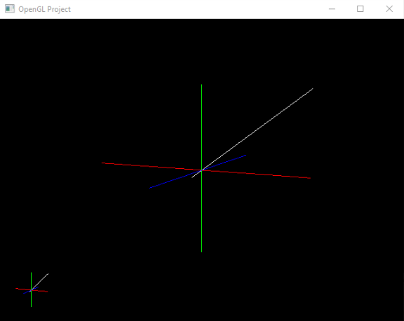

# corner-axis
A very simple xyz coordinate axis at corner of screen, representing the direction of camera.

This project uses OpenGl.

Dependencies:
- [freeglut](http://freeglut.sourceforge.net/)

  
  

